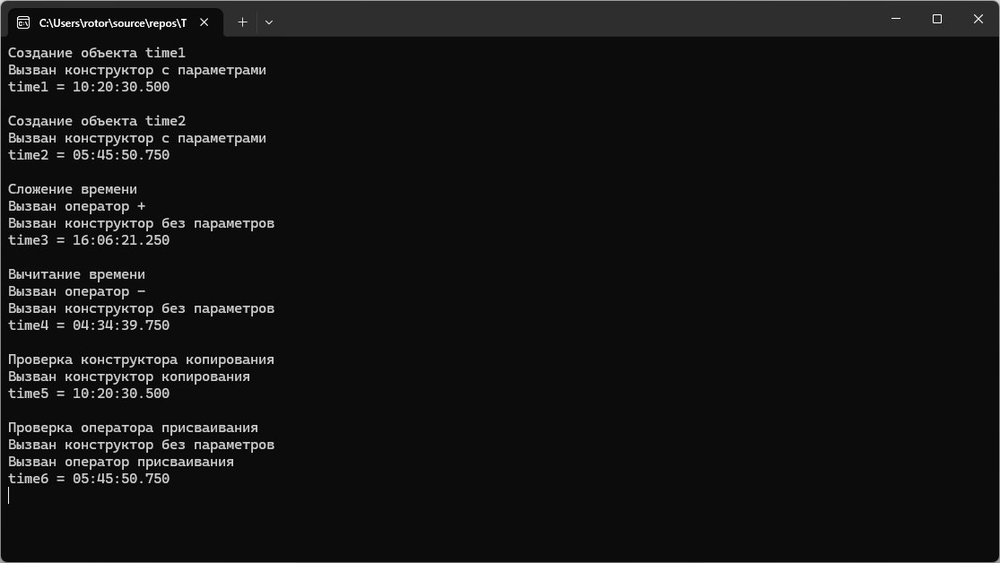

# Модуль 2. Задание 4. Вариант 2
Практическая работа по объектно-ориентированному программированию.

## Возможности программы
- создание объектов класса Time;
- хранение часов, минут, секунд и миллисекунд;
- вывод времени на экран;
- использование конструктора копирования;
- использование оператора присваивания;
- перегрузка оператора сложения времени;
- перегрузка оператора вычитания времени;
- автоматическая нормализация времени.

## Пример работы программы

